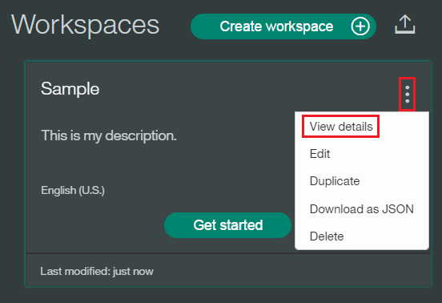

# Build a Car Conversation Dashboard Application Using Bluemix Watson Service

## Overview

This application demonstrates how the Bluemix Conversation services can be used to build a simple on-board car chat application.

* We will learn and understand how to integrate the Conversation service with other REST APIs such as NLU, weather etc.
* Opportunity to explore further, enhancing the functionalities of the chat application.

Following services used from Bluemix:
1. Watson Conversation
2. Watson NLU
3. IBM Weather Company Data

[See the app demo](http://conversation-demo.mybluemix.net/).

For more information about Conversation, see the [detailed documentation](http://www.ibm.com/watson/developercloud/doc/conversation/overview.shtml).

## How the app works
The app interface is designed and trained for chatting with a cognitive car. The chat interface is on the left, and the
JSON that the JavaScript code receives from the server is on the right. Your questions and commands are run against a small set of sample data trained with intents like these:

    turn_on
    weather
    capabilities

These intents help the system to understand variations of questions and commands that you might submit.

Example commands that can be executed by the Conversation service are:

    turn on windshield wipers
    find restaurants

If you say *"Wipers on"* or *"I want to turn on the windshield wipers"*, the system
understands that in both cases your intent is the same and responds accordingly.

<a name="bluemix">
# Getting Started using Bluemix
</a>

## Pre Requisities
1 Ensure that you have a [Bluemix account](https://console.ng.bluemix.net/registration/).

2 This action deploys 1 application and 3 services.
   * You can view this on your Bluemix Dashboard.

## PART - 1
## <u>Deploy the App and explore the conversation flow</u>
1 Select "Deploy to Bluemix" icon below.

&nbsp;&nbsp;&nbsp;&nbsp;&nbsp;&nbsp;&nbsp;&nbsp;&nbsp;&nbsp;&nbsp;&nbsp; 

2 Log in with an existing Bluemix account or sign up.

3 Name your app and select your REGION, ORGANIZATION, and SPACE. Then select DEPLOY.
&nbsp;&nbsp;&nbsp;&nbsp;&nbsp;&nbsp;&nbsp;&nbsp;&nbsp;&nbsp;&nbsp;&nbsp; 

Note: In case Space is not listed. Please take help and create it manually.

* This performs two actions:
  - Deploys the app run time.
  - Creates a Conversation service instance, NLU Instance, Weather API instance.

* The status of the deployment is shown. This can take some time.

&nbsp;&nbsp;&nbsp;&nbsp;&nbsp;&nbsp;&nbsp;&nbsp;&nbsp;&nbsp;&nbsp;&nbsp;

Note:
* If the deployment fails it might mean that you dont have a repository. To fix this refer to the screen shots below.

4 Once your app has deployed, select VIEW YOUR APP.

&nbsp;&nbsp;&nbsp;&nbsp;&nbsp;&nbsp;&nbsp;&nbsp;&nbsp;&nbsp;&nbsp;&nbsp;

<a name="workspace">
# Import a workspace
</a>

To use the app you're creating, you need to add a worksapce to your Conversation service. A workspace is a container for all the artifacts that define the behavior of your service (ie: intents, entities and chat flows).

For more information on workspaces, see the full  [Conversation service  documentation](https://www.ibm.com/smarterplanet/us/en/ibmwatson/developercloud/doc/conversation/overview.shtml).

1 Navigate to the Bluemix dashboard, select the Conversation service that you created.

2 Go to the **Manage** menu item and select **Launch Tool**. This opens a new tab in your browser, where you are prompted to login if you have not done so before. Use your Bluemix credentials.

3 Download the exported file that contains the Workspace contents by clicking
[exported JSON file](https://github.com/WatsonISA/car-dashboard)
  - navigate to the training folder to find car_workspace_alchemy.json file.
  - click on the "Raw" link which will open a browser.
  - Select "Save As" and save the file as a json.

4 Select the import icon: . Browse to (or drag and drop) the JSON file. Choose to import **Everything(Intents, Entities, and Dialog)**. Then select **Import** to finish importing the workspace.

5 Refresh your browser. A new workspace tile is created within the tooling. Select the _menu_ button within the workspace tile, then select **View details**:

&nbsp;&nbsp;&nbsp;&nbsp;&nbsp;&nbsp;&nbsp;&nbsp;&nbsp;&nbsp;&nbsp;&nbsp;

<a name="workspaceID">
In the Details UI, copy the 36 character UNID **ID** field. This is the **WORKSPACE_ID**.
</a>. Retain this for the following step where we will create an environment variable
This varibale will be the handle for the application to refer to the Conversation Service that we created.

&nbsp;&nbsp;&nbsp;&nbsp;&nbsp;&nbsp;&nbsp;&nbsp;&nbsp;&nbsp;&nbsp;&nbsp; 

<a name="env">
# Adding environment variables in Bluemix
</a>

1 In Bluemix, open the application from the Dashboard.(You will have to click on the Application Name) Select **Environment Variables**.

2 Select **USER-DEFINED**.

3 Select **ADD**.

4 Add a variable with the name **WORKSPACE_ID**. For the value, paste in the Workspace ID you [copied earlier](#workspaceID). Select **SAVE**.

&nbsp;&nbsp;&nbsp;&nbsp;&nbsp;&nbsp;&nbsp;&nbsp;&nbsp;&nbsp;&nbsp;&nbsp;

5 Restart your application.

6 Click on the application link to execute it. Now you are all set to have a conversation!!

  Here are some sample questions that you can start off with

   - Can you switch on
   - Can you find a gas station

# Troubleshooting in Bluemix

#### In the Classic Experience:
- Log in to Bluemix, you'll be taken to the dashboard.
- Navigate to the the application you previously created.
- Select **Logs**.

&nbsp;&nbsp;&nbsp;&nbsp;&nbsp;&nbsp;&nbsp;&nbsp;&nbsp;&nbsp;&nbsp;&nbsp;

- If you want, filter the LOG TYPE by "APP".

&nbsp;&nbsp;&nbsp;&nbsp;&nbsp;&nbsp;&nbsp;&nbsp;&nbsp;&nbsp;&nbsp;&nbsp;

#### In the new Bluemix:
- Log in to Bluemix, you'll be taken to the dashboard.
- Select **Compute**

&nbsp;&nbsp;&nbsp;&nbsp;&nbsp;&nbsp;&nbsp;&nbsp;&nbsp;&nbsp;&nbsp;&nbsp;

- Select the application you previously created.
- Select **Logs**.

&nbsp;&nbsp;&nbsp;&nbsp;&nbsp;&nbsp;&nbsp;&nbsp;&nbsp;&nbsp;&nbsp;&nbsp;

- If you want, filter the Log Type by selecting the drop-down and selecting **Application(APP)**.

&nbsp;&nbsp;&nbsp;&nbsp;&nbsp;&nbsp;&nbsp;&nbsp;&nbsp;&nbsp;&nbsp;&nbsp;

## PART - 2

## PART - 3

# License

  This sample code is licensed under Apache 2.0.
  Full license text is available in [LICENSE](LICENSE).

# Contributing

  See [CONTRIBUTING](CONTRIBUTING.md).

## Open Source @ IBM

  Find more open source projects on the
  [IBM Github Page](http://ibm.github.io/).
