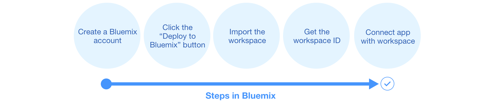
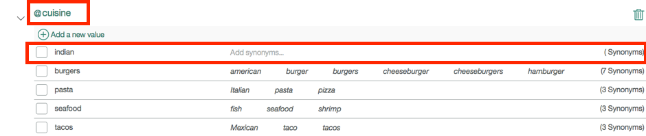

# Build a Car Conversation Dashboard application using Bluemix & Watson Services

## Overview

This application demonstrates how the Bluemix Conversation service can be used to build a simple on-board car chat application.

* We will learn and understand how to integrate the Conversation service with other REST APIs such as NLU, Weather etc
* We will explore further how to enhance the functionalities of the chat application

Following services are used from Bluemix:
1. Watson Conversation
2. Watson NLU
3. IBM Weather Company Data

See the app [demo](http://conversation-demo.mybluemix.net/)

For more information about Conversation, see the [detailed documentation](https://www.ibm.com/watson/developercloud/doc/conversation/index.html).

## How the app works

The app interface is designed and trained for chatting with a cognitive car. The chat interface is on the left, and the
JSON that the JavaScript code receives from the server is on the right. Your questions and commands are run against a small set of sample data trained with intents like these:

    turn_on
    weather
    capabilities

These intents help the system to understand variations of questions and commands that you might submit.

Example commands that can be executed by the Conversation service are:

    turn on windshield wipers
    find restaurants

If you say *"Wipers on"* or *"I want to turn on the windshield wipers"*, the system understands that in both cases your intent is the same and responds accordingly.  



## Pre-requisities

Ensure that you have a [Bluemix account](https://console.ng.bluemix.net/registration/)

## PART - 1

### Deploy the app and explore the conversation flow

1. Select "Deploy to Bluemix" icon below.

&nbsp;&nbsp;&nbsp;&nbsp;&nbsp;&nbsp;&nbsp;&nbsp;&nbsp;&nbsp;&nbsp;&nbsp;[](https://bluemix.net/deploy?repository=https://github.com/WatsonISA/car-dashboard)

2. This action deploys 1 application and 3 services. You can view this on your Bluemix Dashboard.

3. Log in with your existing Bluemix account or Sign up

4. Name your app and select your REGION, ORGANIZATION and SPACE. Then select DEPLOY.

&nbsp;&nbsp;&nbsp;&nbsp;&nbsp;&nbsp;&nbsp;&nbsp;&nbsp;&nbsp;&nbsp;&nbsp; 

**Note:** If the "Space" does not get listed, please take help and create it manually

5. The deploy performs two actions:  

    * deploys the app run time
    * creates a Conversation, NLU and Weather service instances

6. The deployment can take some time. You can see its status like the one given below:

&nbsp;&nbsp;&nbsp;&nbsp;&nbsp;&nbsp;&nbsp;&nbsp;&nbsp;&nbsp;&nbsp;&nbsp;

**Note:**
 - Existing Bluemix users with Toolchain Id will see a screen like this.


 - For users without a Toolchain Id, the deployment might fail. It might mean that the user does not have a repository. To fix this, refer to the screen shots below.


7. Once your app is deployed, select VIEW YOUR APP

&nbsp;&nbsp;&nbsp;&nbsp;&nbsp;&nbsp;&nbsp;&nbsp;&nbsp;&nbsp;&nbsp;&nbsp;

### Importing a workspace

To use the app you're creating, you need to add a worksapce to your Conversation service. A workspace is a container for all the artifacts that define the behavior of your service (ie: intents, entities and chat flows).

For more information on workspaces, see the full  [Conversation service documentation](https://www.ibm.com/watson/developercloud/doc/conversation/index.html).

1. Navigate to the Bluemix dashboard, select the Conversation service that you created

2. Go to the **Manage** menu item and select **Launch Tool**. This opens a new tab in your browser, where you are prompted to login if you have not done so before. Use your Bluemix credentials.

3. Download the exported file that contains the Workspace contents by clicking [exported JSON file](https://github.com/WatsonISA/car-dashboard)
    - navigate to the training folder to find `car-dashboard.json` file
    - click on the "Raw" link which will open a browser
    - Select "Save As" and save the file as a json

4. Select the import icon: . Browse to (or drag and drop) the JSON file. Choose to import **Everything(Intents, Entities, and Dialog)**. Then select **Import** to finish importing the workspace.

5. Refresh your browser. A new workspace tile is created in the tool. Select the _menu_ button within the workspace tile, then select **View details**:

&nbsp;&nbsp;&nbsp;&nbsp;&nbsp;&nbsp;&nbsp;&nbsp;&nbsp;&nbsp;&nbsp;&nbsp;

In the Details UI, copy the 36 character UNID **ID** field. This is the **WORKSPACE_ID**. Retain this for the following step where we will create an environment variable. This varibale will be the handle for the application to refer to the Conversation Service that we created.

&nbsp;&nbsp;&nbsp;&nbsp;&nbsp;&nbsp;&nbsp;&nbsp;&nbsp;&nbsp;&nbsp;&nbsp; 

### Adding environment variables in Bluemix

1. In Bluemix, open the application from the Dashboard (you will have to click on the Application Name). Select **Runtime** followed by the **Environment Variables** tab on the right.

2. Scroll down the page to select **USER-DEFINED**

3. Select **ADD**

4. Add a variable with the name **WORKSPACE_ID**

For the value, paste in the Workspace ID you [copied earlier](#workspaceID). Select **SAVE**.

&nbsp;&nbsp;&nbsp;&nbsp;&nbsp;&nbsp;&nbsp;&nbsp;&nbsp;&nbsp;&nbsp;&nbsp;

5. Restart your application

6. Click on the application link to execute it. Now you are all set to have a conversation !

Here are some sample questions that you can start off with,

   - Can you switch on music ?
   - Can you find a gas station ?


### Troubleshooting in Bluemix

#### In the Classic Experience:

- Log in to Bluemix, you'll be taken to the dashboard
- Navigate to the the application you previously created
- Select **Logs**

&nbsp;&nbsp;&nbsp;&nbsp;&nbsp;&nbsp;&nbsp;&nbsp;&nbsp;&nbsp;&nbsp;&nbsp;

- If you want, filter the LOG TYPE by "APP"

&nbsp;&nbsp;&nbsp;&nbsp;&nbsp;&nbsp;&nbsp;&nbsp;&nbsp;&nbsp;&nbsp;&nbsp;

#### In the new Bluemix:

- Log in to Bluemix, you'll be taken to the dashboard
- Select **Compute**

&nbsp;&nbsp;&nbsp;&nbsp;&nbsp;&nbsp;&nbsp;&nbsp;&nbsp;&nbsp;&nbsp;&nbsp;

- Select the application you previously created
- Select **Logs**

&nbsp;&nbsp;&nbsp;&nbsp;&nbsp;&nbsp;&nbsp;&nbsp;&nbsp;&nbsp;&nbsp;&nbsp;

- If you want, filter the Log Type by selecting the drop-down and selecting **Application(APP)**

&nbsp;&nbsp;&nbsp;&nbsp;&nbsp;&nbsp;&nbsp;&nbsp;&nbsp;&nbsp;&nbsp;&nbsp;

## PART - 2

**Problem statement:** Adding new cuisine types for Indian cuisine like Veg and Non Veg and display respective restaurants

1) Go to the Bluemix Dashboard

2) Go to the Conversation service link. Click on the "Launch Tooling" link.

3) Go to the Entities section. Add entity - "indiancuisine".

Add values for this entity like - Vegetarian and NonVegetarian.
Add synonyms to both of these values like "non veg", "Non veg", "veg", "Veg".


4) Add another value of cuisine which is "indian"



5) Go to the Dialog section and add the condition from cuisine as displayed in the screen shot below for two of the condition for Indian flavours.


We would add the context values for Indian Vegetarian and Non Vegetarian hotels

a) Indian Vegetarian


Sample JSON code:
```
{
  "context": {
    "veghotels": "A2B,Vidyarthi"
  },
  "output": {
    "text": {
      "values": [
        "Sure thing. Navigating to the @cuisine:vegetarian restaurant.   Following $veghotels  gets great reviews. You'll be there soon."
      ]
    }
  }
}
```

b) Non Vegetarian


Sample JSON code:
```
{
  "context": {
    "nonveghotels": "Mass,KFC"
  },
  "output": {
    "text": {
      "values": [
        "Sure thing. Navigating to the @cuisine:vegetarian restaurant.   Following $nonveghotels  gets great reviews. You'll be there soon."
      ]
    }
  }
}
```

6) Add "Jump To" (see the highlighted section in the screen shot) connection to response of @cuisine


## PART - 3

Below is the API usage architecture diagram of this application


Whenever the chat transcript contains a query regarding "weather" of a place, the Conversation service uses NLU to identify the entities like city / town and invokes the Weather service to get the weather details of that city / town.

You can type a query like, "what is the temperature in Bangalore today ?" and the application will respond accordingly.

## License

This sample code is licensed under Apache 2.0. Full license text is available in [LICENSE](LICENSE).

## Contributing

See [CONTRIBUTING](CONTRIBUTING.md)


## Open Source @ IBM

Find more open source projects on the [IBM Github Page](http://ibm.github.io/)
